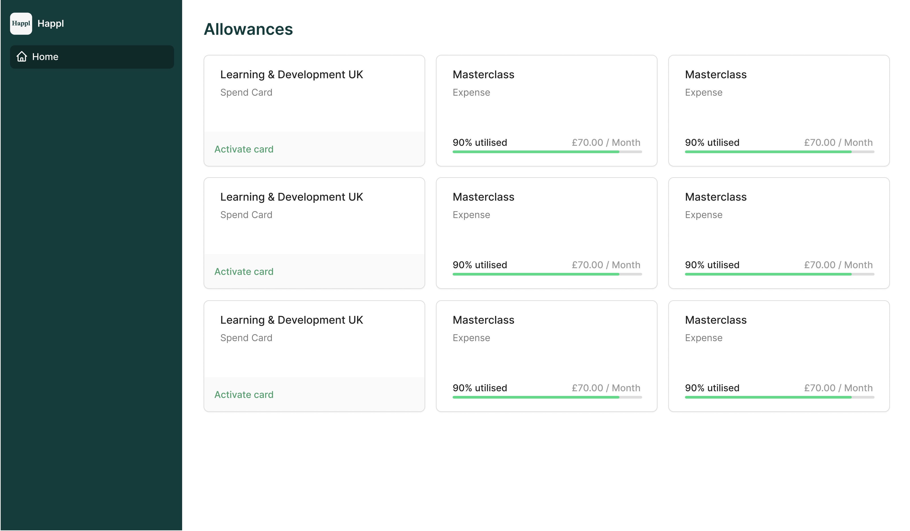

# Happl Frontend Interview Task

For this task we'd like you to build the allowances list UI:



This isn't designed to take a huge amount of time, we're more interested in how you approach the task rather than the final result. It would be great if you could add some types and tests. You can find the designs on [figma](https://www.figma.com/file/NrNBzd7Qja4fuCmwMsOLVK/Frontend-Task).

To get started fork this repository, and once completed send us an email with a link to your repository.

If you have any questions please feel free to email us.

## Getting Started

### Running

First, install the dependencies:

```bash
yarn
```

To run the development server on [http://localhost:3000](http://localhost:3000):

```
yarn dev
```

### Tests

To run the tests, use:

```
yarn test
```

### Typescript

To check for type errors, use:

```
yarn tsc
```

### Lint

To run lint, use:

```
yarn lint
```

### Prettier

To run prettier, use:

```
yarn format
```
